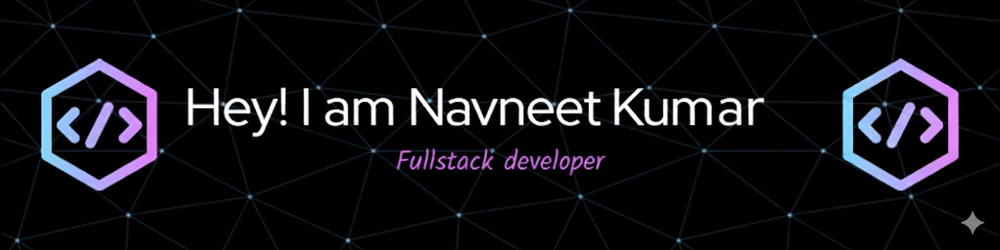

💫 About Me:

I'm an aspiring Full Stack web Developer and Competitive Programmer with a keen interest in building engaging and user-friendly web applications. While I'm still on my journey to becoming a proficient developer, I'm always eager to learn new things and improve my skills.

I've been exploring various technologies, including HTML, CSS, JavaScript, React, REST APIs, MongoDB, Node.js. I'm also actively participating in competitive programming challenges to enhance my problem-solving abilities and understanding of algorithms and data structures.

I enjoy contributing to open-source projects and exploring emerging technologies. I'm always looking for opportunities to collaborate and learn from experienced developers.

👩🏾‍💻 Skills:
Expertise : Data Structure and Algorithm , OOPS, Web Development
Language : C, Java, HTML, CSS, JavaScript, SQL
Libraries/Framework : React.js, Node.js, Express.js, Tailwind CSS
Database : MongoDB, MySQL
Additional Skills: Problem-Solving, Git, GitHub, VS Code, Render, Postman

